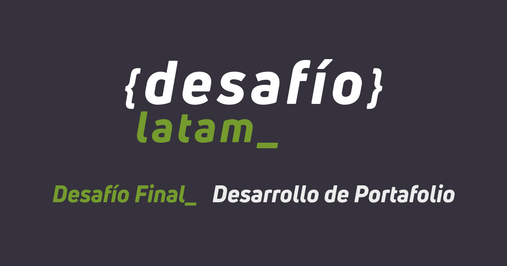
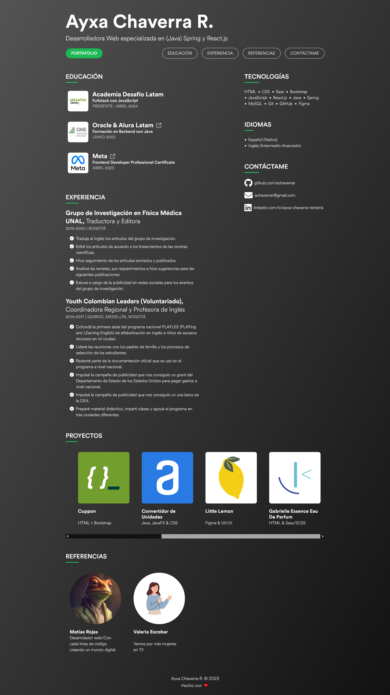

# Solución a Desafío Final - Desarrollo de portafolio

## Academia Desafío Latam | Bootcamp Fullstack con JavaScript - G41

### Descripción

Este proyecto consiste en mi hoja de vida y portafolio hechos solamente con HTML, CSS, e íconos de Font Awesome. La página está desplegada en GitHub Pages y puede ser visitada por medio de [este enlace](https://achaverrar.github.io).

### Trabajo Colaborativo

Forkeé y envié pull requests a los repositorios de los siguientes compañeros:

- [Jorge López](https://github.com/jorgelopezd/jorgelopezd.github.io)
- [Maglys Maita](https://github.com/maglys82/CvMaglysMaita)
- [Pedro Salinas](https://github.com/pesalinassilva/pesalinassilva)
- [Javier Figueroa](https://github.com/javiernfigueroa/javiernfigueroa)
- [Matías Rojas](https://github.com/mattias914/mattias914)
- [Juan Lemus](https://github.com/achaverrar/JuanLemus07.github.io)
- [Valeria Escobar](https://github.com/Val393/Val393.github.io)
- [Christopher López](https://github.com/chrislopez93/chrislopez93)

Recibí y acepté las pull requests de los siguientes compañeros:

- [Matías Rojas](https://github.com/mattias914)
- [Juan Lemus](https://github.com/achaverrar/JuanLemus07.github.io)
- [Pedro Salinas](https://github.com/pesalinassilva)

### Previsualización

